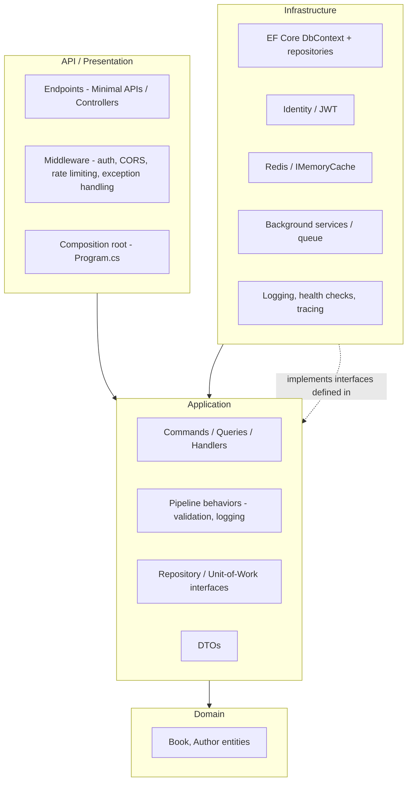
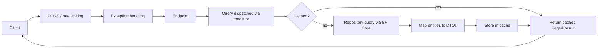
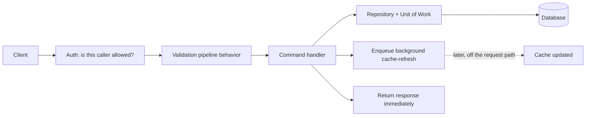

# Book Catalog API — Architecture Overview

> A companion to the [.NET API Development Roadmap](dotnet-api-roadmap.md). The roadmap and the
> 16 [learning path documents](learning-paths/) tell you *what to build, milestone by milestone*.
> This document looks at the *same* 16 paths from a different angle: what the Book Catalog API's
> architecture looks like at the end, how it gets there one path at a time, and why the paths are
> sequenced the way they are. It's a map of the structure you're building, not another checklist.

## Purpose

Sixteen paths, each with its own milestones, can make it hard to see the forest for the trees —
you can finish Path 09 having correctly implemented JWT auth without necessarily seeing *where*
that auth logic sits relative to everything else, or *why* it had to wait until Path 09 instead of
happening in Path 01. This document exists to answer exactly that: for each meaningful piece of the
system, where does it live architecturally, when does it get introduced, and how does it relate to
everything around it.

This is a reference to revisit, not a one-time read. Come back to it after finishing a path to see
where what you just built fits into the whole.

## The Final Target Architecture

By the end of Path 16, the Book Catalog API is organized into four layers, with dependencies
pointing in exactly one direction — inward, toward `Domain`:

| Layer | Responsibility | Depends on |
|---|---|---|
| **Domain** | The entities and rules that don't need anything external to make sense (`Book`, `Author`). | Nothing. |
| **Application** | What the API actually *does*: business logic, validation rules, the interfaces Infrastructure implements, the request/response DTOs, and (from Path 16) Commands/Queries/handlers and pipeline behaviors. | Domain only. |
| **Infrastructure** | How things actually happen: EF Core, Identity, Redis, background workers, logging/tracing plumbing. | Application, Domain. |
| **API / Presentation** | How the outside world talks to the system: endpoints, middleware, the composition root that wires everything together at startup. | Application, Infrastructure (only at the composition root). |

Nothing outside Domain leaks into it. Application never reaches into Infrastructure directly — it
only knows about interfaces, which Infrastructure implements. This is the shape Path 16 makes
explicit, but as you'll see below, most of the pieces already exist long before Path 16 — that
path's real job is *drawing the boundaries* around work you'd already done.

## How a Request Actually Flows Through This

**A read request** (e.g. `GET /api/v1/books?genre=fantasy`):

**A write request** (e.g. `POST /api/v1/books`):

Notice the write path returns to the client *before* the cache refresh actually happens — that's
Path 14's queued background work, deliberately keeping the write fast.

## Cross-Cutting Concerns, and Where They Actually Live

Some things aren't "in" any one layer — they cut across all of them. Knowing where each one is
implemented (versus where it's merely *felt*) matters:

| Concern | Introduced in | Implemented in | Applied at |
|---|---|---|---|
| Dependency injection & configuration | Path 02 | Application defines interfaces/options; Infrastructure provides implementations | Composition root (API) |
| Persistence | Path 03 | Infrastructure (EF Core) | Behind Application's repository interfaces |
| Validation | Path 08 | Application (validators, later a pipeline behavior in Path 16) | Every Command/Query that carries input |
| Authentication & authorization | Path 09 | Infrastructure (Identity/JWT) + Application (custom policy logic) | API middleware, per-endpoint |
| Security hardening (CORS, rate limiting, HSTS) | Path 10 | API/Presentation | Composition root, applied globally or per-policy |
| Observability (logs, health, tracing) | Path 12 | Infrastructure | Everywhere, via DI-provided loggers/instrumentation |
| Caching | Path 13 | Infrastructure | Behind the same repository/query boundary Application already uses |
| Background work | Path 14 | Infrastructure (hosted services), triggered from Application | A second entry point into the system, alongside HTTP |
| Versioning | Path 07 | API/Presentation (routing) | Two parallel API surfaces sharing one Application/Infrastructure core |
| Testing | Path 11 | Its own test projects | Exercises Application logic in isolation (unit) and the whole stack (integration) |

## The Architecture's Evolution, Path by Path

The roadmap's paths aren't in an arbitrary order — each one either introduces a new architectural
piece, or draws a boundary around pieces that already exist. Here's the same 16 paths, read as a
sequence of structural decisions rather than a list of milestones.

### Track A – Foundations

**Path 01** lays down the API/Presentation layer's skeleton: routing, model binding, the
middleware pipeline. Nothing is "layered" yet — there's just one project — but every later
architectural decision needs somewhere to attach to, and this is that somewhere.

**Path 02** introduces the DI container and configuration as first-class concerns. This is the
single most important architectural enabler in the whole roadmap: without a container that can
resolve dependencies by interface, nothing later — swappable repositories, testable handlers,
environment-specific behavior — is possible. Configuration also establishes that behavior can
change *without recompiling*, a precondition for Path 15's "build once, configure per environment"
rule.

### Track B – Data Layer

**Path 03** introduces the first genuinely Infrastructure-shaped component: EF Core's `DbContext`.
At this point it's still referenced directly from the API layer — there's no formal boundary yet,
just the raw capability.

**Path 04** is where the Application/Infrastructure boundary is *born*, even though it isn't named
that yet. Wrapping `DbContext` behind `IBookRepository`/`IAuthorRepository`/`IUnitOfWork`
interfaces is exactly the seam Path 16 later formalizes as "Application defines it, Infrastructure
implements it." Path 04's ADR — keep, simplify, or revert — is really an early referendum on
whether that architectural seam is worth having at all.

### Track C – API Design & Contracts

**Path 05** introduces the second major boundary: DTOs separating the wire contract from the
domain entities. This is the seed of the Application/API split — entities stay internal, DTOs are
what crosses the boundary to a client. It's also what finally lets Path 03's circular-reference
workaround be retired for good, since a DTO that never includes a back-navigation can't cycle.

**Path 06** turns the API layer's contract into a first-class, generated artifact (the OpenAPI
spec) instead of something only visible by reading endpoint code.

**Path 07** is the moment the architecture is proven, not just described: two parallel API
surfaces (`v1`/`v2`) share the *same* Application and Infrastructure underneath, differing only in
their DTOs and routing. If Path 04 and Path 05's boundaries weren't real, this path would be where
duplicated business logic starts leaking out — instead, it's where you confirm they held.

### Track D – Validation & Error Handling

**Path 08** establishes validation and error handling as genuine cross-cutting concerns —
logic that every write operation needs, expressed once (a validator, an exception handler) instead
of copy-pasted per endpoint. This is architecturally significant because it's the direct
predecessor of Path 16's pipeline behaviors: a pipeline behavior is just this same idea, formalized
with a mechanism (the mediator) that applies it automatically instead of by convention.

### Track E – Security

**Path 09** adds an entirely new component category: identity and authorization. Architecturally,
authentication/authorization sits at the API boundary (deciding whether a request is even allowed
to reach a handler) while the *rules* about who's allowed to do what (the custom claims-based
policy) live in Application, alongside every other business rule.

**Path 10** hardens the edges of the API layer itself — CORS, rate limiting, HSTS — protecting the
boundary between the untrusted outside world and everything behind it, without touching what's
behind that boundary at all.

### Track F – Quality & Testing

**Path 11** is where the layering gets its first real *proof*: unit tests can exercise Application
logic (a validator, a custom authorization handler, the with-first-book atomicity logic) entirely
in isolation, with no server and no database, precisely because Path 02 and Path 04 made those
pieces resolvable and replaceable. If unit-testing something requires spinning up the whole API,
that's a sign the architecture isn't actually decoupled yet — Path 11 is where you find out.

**Path 12** threads observability through every layer at once: Infrastructure provides the
logging/tracing implementation, but every layer's code emits it, and the API layer exposes it
(health endpoints) to the outside world.

### Track G – Performance & Scalability

**Path 13** inserts caching *behind* the same boundary Application already uses to reach data —
callers don't know or care whether a repository call hit a cache or the database, which is exactly
why the caching abstraction could slot in without touching Application at all.

**Path 14** introduces a second way *into* Application: background work, triggered by a timer or a
queue instead of an HTTP request. Architecturally, this matters because it proves Application logic
isn't secretly coupled to `HttpContext` or anything else request-specific — if it were, it
couldn't be invoked from a background service at all.

### Track H – Production Readiness

**Path 15** is a change in perspective more than a change in the code: how does this whole layered
system get packaged and run somewhere that isn't your machine? This is where "build once,
configure per environment" (an idea Path 02 introduced) gets tested for real, and where Path 12's
health checks and Path 14's graceful shutdown finally get a consumer other than a human.

**Path 16** is the capstone: it takes every boundary that's existed informally since Path 04 and
Path 05 and makes it explicit — separate projects (or clearly separated folders) with a compiler
(or discipline) enforcing the dependency direction. CQRS and the mediator formalize Path 08's
"cross-cutting concern applied once" idea into an actual mechanism (pipeline behaviors). The
capstone ADR is the moment you find out whether all of this was worth it for a project this size —
which is the entire point of the roadmap, not an afterthought at the end of it.

## Component Inventory

Every major architectural component across the whole project, and where it ultimately lives:

| Component | Introduced in | Final layer |
|---|---|---|
| `Book`, `Author` entities | Path 01 / Path 03 | Domain |
| `IBookRepository`, `IAuthorRepository`, `IUnitOfWork` | Path 04 | Application (interfaces) |
| EF Core `DbContext` + repository implementations | Path 03 / Path 04 | Infrastructure |
| FluentValidation validators | Path 08 | Application |
| DTOs (`BookResponse`, `BookCreateRequest`, `PagedResult<T>`, etc.) | Path 05 | Application/API boundary — a genuine judgment call, revisited explicitly in Path 16 |
| ASP.NET Core Identity, JWT issuing | Path 09 | Infrastructure |
| Custom authorization policy + handler | Path 09 | Application (the rule) enforced at API (the boundary) |
| CORS, rate limiting, HSTS configuration | Path 10 | API/Presentation composition root |
| Unit + integration test projects | Path 11 | Their own projects, exercising Application (unit) and the whole stack (integration) |
| Serilog, health checks, OpenTelemetry | Path 12 | Infrastructure (implementation), wired at the composition root |
| `IMemoryCache` / `IDistributedCache` (Redis) | Path 13 | Infrastructure |
| `IBackgroundTaskQueue`, `BackgroundService`s | Path 14 | Infrastructure (implementation), triggered from Application |
| Dockerfile, docker-compose, CI pipeline | Path 15 | Outside the layers entirely — packaging and delivery |
| Commands, Queries, handlers, pipeline behaviors | Path 16 | Application |

## Three End-to-End Data Flow Examples

### 1. Anonymous read: `GET /api/v1/books?genre=fantasy`

API middleware (no auth required) → the endpoint dispatches a Query → Application checks the
cache (Infrastructure, behind the repository boundary) → on a miss, queries via the repository →
maps entities to `BookResponse` DTOs → stores the result in the cache → returns the
`PagedResult<BookResponse>` to the client.

### 2. Authenticated write: `POST /api/v1/books`

API middleware confirms the caller is authenticated and holds the `Contributor` or `Admin` role →
the endpoint dispatches a Command → a pipeline behavior runs validation before the handler ever
executes → the handler uses the repository/unit-of-work to persist the new book → the handler
enqueues a background cache-refresh work item → the response returns to the client immediately,
**not** waiting for the cache refresh → sometime after, the background service dequeues the item
and refreshes the cache.

### 3. Periodic background job: no HTTP request at all

The host's timer fires the periodic `BackgroundService` → it creates a new DI scope (via
`IServiceScopeFactory`, never receiving a scoped dependency directly) → resolves a repository
through that scope → queries for books created since the last run → logs a structured summary via
the same logging infrastructure every HTTP request uses. Nothing here starts at the API layer at
all — proof that Application's logic doesn't secretly assume it's being called from a controller.

## Why This Sequence?

A few of the roadmap's ordering decisions are architectural, not arbitrary:

- **DI/config (Path 02) before persistence (Path 03).** Persistence needs to be resolvable and
  swappable to be testable later — that requires a container first.
- **Repository/Unit of Work (Path 04) right after EF Core (Path 03), but before DTOs (Path 05).**
  The data-access boundary is established before the wire-contract boundary, so each boundary can
  be reasoned about on its own instead of both changing at once.
- **Versioning (Path 07) after DTOs (Path 05) and documentation (Path 06).** You can't
  meaningfully version a contract that isn't yet explicit (DTOs) or discoverable (OpenAPI).
- **Testing (Path 11) after most features, before performance/deployment work (Paths 13–15).**
  You want a safety net in place before the highest-risk, widest-blast-radius changes — caching,
  background processing, containerization, and the Path 16 restructuring all lean on it heavily.
- **Architecture (Path 16) last, not first.** You cannot make an honest, evidence-based decision
  about whether Clean Architecture and CQRS are worth it for this project until you've felt what
  the codebase is like *without* them for fifteen paths first. Doing this path first would have
  made every later verdict a guess instead of a conclusion.

## What This Document Is Not

- It is **not** a replacement for the per-path milestone documents in
  [`docs/learning-paths/`](learning-paths/) — those still tell you exactly what to build and how
  to verify it.
- It is **not** prescriptive C# — no solution code appears here, the same rule as every other
  document in this project.
- It is **not** fixed in stone. Several component placements above (DTOs, exactly which claims
  belong in Application vs. Infrastructure) are explicitly judgment calls the roadmap asks you to
  make yourself — this document describes one reasonable answer, not the only one.
