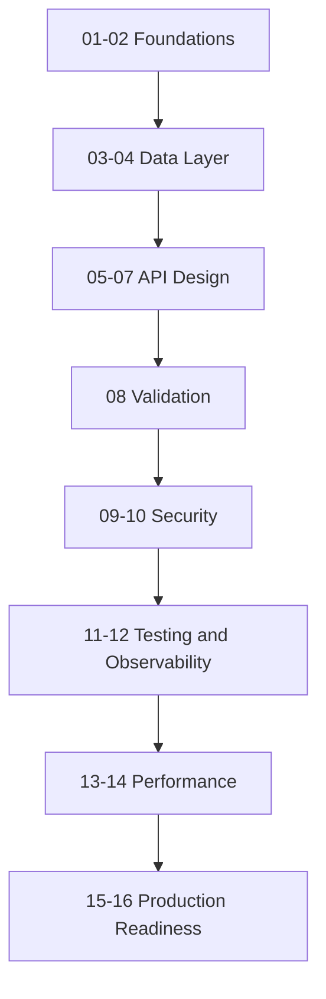

# .NET API Development – Learning Roadmap

## Purpose

This document is the index/roadmap for learning API development in .NET. It breaks the overall
goal down into focused **learning paths**, each covering one important part of building real-world
.NET APIs.

In line with the project's [approach](../README.md#about-this-project): I write all the code myself.
AI is used only in **ask mode**, acting as a senior developer — explaining concepts, reviewing my
reasoning, and pointing out what to improve. This roadmap and the per-path documents are meant to
guide that process, not replace it.

## How this roadmap works

- Each learning path below will get its **own document** (created separately) with the detailed
  instructions for a mini learning project.
- Suggested location/naming for those future documents: `docs/learning-paths/NN-topic-slug.md`
  (e.g. `docs/learning-paths/01-aspnet-core-fundamentals.md`).
- These are **project-based**, not theory-based: the point is to code, not to read essays or
  answer quiz questions. Every per-path document follows the same shape:
  1. **Project Brief** – what you're building and the real scenario behind it.
  2. **Rules** – constraints that force you to actually practice the target skill (e.g. no ORM
     yet, no auth library yet).
  3. **Milestones** – an ordered, checkable list of small build steps; each one should run and be
     manually testable before you move to the next.
  4. **Stretch Goals** – optional harder extensions once the milestones are done.
  5. **Definition of Done** – a checklist to know you're actually finished.
  6. **Reference Docs** – links to check only when stuck while coding, not required reading
     upfront.
- Almost every path below **extends the same running project** — the Book Catalog API from
  Path 01 — so you feel one API evolve feature by feature instead of jumping between disconnected
  toy examples. If a path uses a fresh standalone project instead, its **Project** line says so.
- Paths are numbered in a suggested learning order, but related paths in the same track can be
  done in parallel or reordered if a topic is already familiar.

## Track A – Foundations

### 01. ASP.NET Core Web API Basics
**Project:** [Book Catalog API](learning-paths/01-aspnet-core-fundamentals.md) (in-memory CRUD) —
the running project every later path below extends.
- Practices: Minimal APIs vs. Controllers, routing, model binding, HTTP verbs and status codes,
  middleware pipeline basics.
- Why it matters: this is the skeleton every other topic builds on.

### 02. Dependency Injection & Configuration
**Project:** Extend the Book Catalog API — move the in-memory store behind an interface, add a
configurable setting (e.g. default page size) read from `appsettings.json`, and demonstrate the
difference between lifetimes with a request-scoped vs. singleton counter.
- Practices: DI container, service lifetimes (Transient/Scoped/Singleton), configuration, the
  Options pattern (`IOptions<T>`).
- Why it matters: almost everything from here on is wired together through DI and configuration.

## Track B – Data Layer

### 03. Data Access with Entity Framework Core
**Project:** Extend the Book Catalog API — swap the in-memory store for a real database using EF
Core.
- Practices: `DbContext`, migrations, entity relationships (e.g. `Author` as its own entity), LINQ
  queries, tracking vs. no-tracking.
- Why it matters: nearly every real API needs to persist and query data properly.

### 04. Repository & Unit of Work Patterns
**Project:** Extend the Book Catalog API — wrap the EF Core `DbContext` behind repository/unit-of-
work interfaces, then decide for yourself whether it actually made the code better.
- Practices: interface-based data access, testability trade-offs.
- Why it matters: knowing when an abstraction helps vs. just adds ceremony is a senior-level call.

## Track C – API Design & Contracts

### 05. RESTful API Design Best Practices
**Project:** Extend the Book Catalog API — introduce DTOs and mapping, and add pagination,
filtering, and sorting to the books list endpoint.
- Practices: resource naming, DTOs vs. entities, AutoMapper/Mapperly, pagination/filtering/sorting
  conventions.
- Why it matters: this is what separates an API that "works" from one that's actually pleasant to
  consume.

### 06. API Documentation with OpenAPI/Swagger
**Project:** Generate accurate, complete OpenAPI documentation for the Book Catalog API.
- Practices: Swashbuckle/NSwag setup, XML doc comments, response type annotations, examples.
- Why it matters: the generated spec is the contract most consumers will actually read.

### 07. API Versioning
**Project:** Ship a breaking change to the Book Catalog API without breaking existing clients —
introduce a `v2` alongside `v1`.
- Practices: URL-based vs. header-based versioning, deprecating endpoints safely.
- Why it matters: real APIs change under you while existing clients keep calling the old shape.

## Track D – Validation & Error Handling

### 08. Validation & Error Handling
**Project:** Extend the Book Catalog API — replace your manual field checks with real validation,
and add global exception-handling middleware that returns consistent `ProblemDetails` responses.
- Practices: FluentValidation/DataAnnotations, exception-handling middleware, RFC 7807
  `ProblemDetails`.
- Why it matters: predictable, well-formed errors are part of the API's contract, not an
  afterthought.

## Track E – Security

### 09. Authentication & Authorization
**Project:** Lock down the Book Catalog API — anyone can read books, only a logged-in user can
create/update/delete them.
- Practices: ASP.NET Core Identity basics, JWT Bearer authentication, roles/policies/claims.
- Why it matters: almost every real API needs to know who's calling and what they're allowed to
  do.

### 10. API Security Hardening
**Project:** Harden the Book Catalog API — add a CORS policy, rate limiting, HTTPS/HSTS
enforcement, and move any secrets out of source control.
- Practices: CORS, rate-limiting middleware, HSTS, User Secrets/environment variables, a
  self-review against the OWASP API Security Top 10.
- Why it matters: security is a checklist you actually run against your own code, not a topic you
  read about once.

## Track F – Quality & Testing

### 11. Automated Testing
**Project:** Write a test suite for the Book Catalog API — unit tests for your business logic,
integration tests for the endpoints themselves.
- Practices: xUnit, mocking with Moq/NSubstitute, integration testing with
  `WebApplicationFactory`.
- Why it matters: tests are what let you keep changing this API in every later path without fear
  of quietly breaking it.

### 12. Logging & Observability
**Project:** Instrument the Book Catalog API — structured logs for key operations, a `/health`
endpoint, and a first look at tracing.
- Practices: structured logging (Serilog), health checks, an intro to OpenTelemetry.
- Why it matters: you can't fix or improve what you can't see once this is running somewhere else.

## Track G – Performance & Scalability

### 13. Caching & Performance
**Project:** Make the Book Catalog API's list endpoint fast under load, and prove it with numbers.
- Practices: in-memory caching, distributed caching (e.g. Redis), response caching, async/await
  pitfalls.
- Why it matters: performance problems are far cheaper to avoid up front than to retrofit later.

### 14. Background Processing
**Project:** Add a background worker to the Book Catalog API — e.g. a periodic job that logs a
summary of books added that day.
- Practices: `IHostedService`/`BackgroundService`, simple queued background work.
- Why it matters: not everything belongs inline in the request/response cycle.

## Track H – Production Readiness

### 15. Containerization & Deployment
**Project:** Containerize the Book Catalog API and its database, and run the whole stack with one
command.
- Practices: writing a Dockerfile, `docker-compose` for local dependencies, environment-based
  configuration, a minimal CI pipeline.
- Why it matters: an API only matters once it can run reliably outside your machine.

### 16. Architecture Patterns
**Project:** Refactor the Book Catalog API into a layered/Clean Architecture solution, and
implement one feature using CQRS with a mediator.
- Practices: Clean/Onion architecture, CQRS, the mediator pattern (e.g. MediatR), layering
  trade-offs.
- Why it matters: by now you've hit enough real friction to appreciate why these patterns exist —
  and when they'd be overkill.

## Suggested Progression

Tracks A through D form a solid path for a first working API. Tracks E through H turn that API
into something closer to production quality — tackle them once the fundamentals feel comfortable.

## Status

| # | Learning Path | Doc Created | Mini Project Done |
|---|----------------|:---:|:---:|
| 01 | [ASP.NET Core Web API Basics](learning-paths/01-aspnet-core-fundamentals.md) | ✅ | ☐ |
| 02 | [Dependency Injection & Configuration](learning-paths/02-dependency-injection-configuration.md) | ✅ | ☐ |
| 03 | [Data Access with Entity Framework Core](learning-paths/03-entity-framework-core.md) | ✅ | ☐ |
| 04 | [Repository & Unit of Work Patterns](learning-paths/04-repository-unit-of-work.md) | ✅ | ☐ |
| 05 | [RESTful API Design Best Practices](learning-paths/05-restful-api-design.md) | ✅ | ☐ |
| 06 | [API Documentation with OpenAPI/Swagger](learning-paths/06-openapi-documentation.md) | ✅ | ☐ |
| 07 | [API Versioning](learning-paths/07-api-versioning.md) | ✅ | ☐ |
| 08 | [Validation & Error Handling](learning-paths/08-validation-error-handling.md) | ✅ | ☐ |
| 09 | [Authentication & Authorization](learning-paths/09-authentication-authorization.md) | ✅ | ☐ |
| 10 | [API Security Hardening](learning-paths/10-api-security-hardening.md) | ✅ | ☐ |
| 11 | [Automated Testing](learning-paths/11-automated-testing.md) | ✅ | ☐ |
| 12 | [Logging & Observability](learning-paths/12-logging-observability.md) | ✅ | ☐ |
| 13 | [Caching & Performance](learning-paths/13-caching-performance.md) | ✅ | ☐ |
| 14 | [Background Processing](learning-paths/14-background-processing.md) | ✅ | ☐ |
| 15 | [Containerization & Deployment](learning-paths/15-containerization-deployment.md) | ✅ | ☐ |
| 16 | [Architecture Patterns](learning-paths/16-architecture-patterns.md) | ✅ | ☐ |
