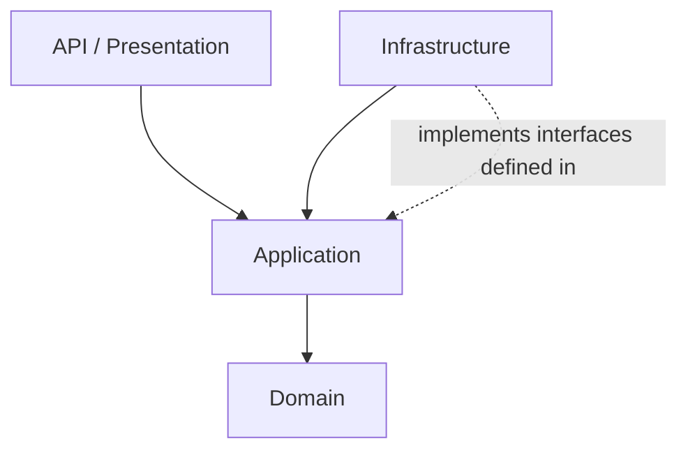

# 16. Architecture Patterns — Book Catalog API

> Part of the [.NET API Development Roadmap](../dotnet-api-roadmap.md). Continues — and
> restructures — the Book Catalog API from [Path 01](01-aspnet-core-fundamentals.md) through
> [Path 15](15-containerization-deployment.md). Build-it project — contracts, test requests, and
> checklists only. No C# solution code. This is the **final path** in the roadmap.

## Project Brief

Fifteen paths of features, hardening, and infrastructure now live together in whatever structure
you happened to grow them in. This path reorganizes the project into Clean/Onion-style layers —
Domain, Application, Infrastructure, and API — with dependencies pointing in exactly one direction,
and reimplements **one** feature using CQRS with a mediator so you can feel what that pattern
actually buys you. Then, like Path 04's repository ADR, you write a real, final decision record —
except this one gets to draw on everything you've built, not just one path's worth of experience.
There's no "correct" verdict expected. There's an expected one: an *earned* one.

## Prerequisites

- [ ] [Path 01](01-aspnet-core-fundamentals.md) through
      [Path 15](15-containerization-deployment.md) are fully done, and Path 11's automated test
      suite passes completely. This path touches almost every file in the project — you need a
      real safety net, not just memory of what used to work.

## Rules

- **No new business features.** This path restructures what exists and migrates exactly one
  feature to CQRS — it doesn't add anything new to what the API does.
- **Run the full Path 11 regression suite after every layer-move milestone, not just at the
  end.** This path has the largest blast radius of anything in the roadmap; catching a break
  immediately is much cheaper than discovering it three milestones later.
- **Migrate exactly one Command and one Query to the mediator.** Rewriting every endpoint this
  way is explicitly out of scope — the point is to feel the pattern, not to spend the rest of the
  roadmap re-plumbing things that already work.
- The closing ADR (M11) must explicitly revisit your Path 04 repository/unit-of-work verdict and
  your Path 05 mapping-library note — this path's conclusions don't stand alone.

## Layer Contract

| Layer | Contains | May depend on | Must NOT depend on |
|---|---|---|---|
| **Domain** | Entities (`Book`, `Author`) and any core rules that need nothing external | Nothing outside Domain | EF Core, ASP.NET Core, or any other framework |
| **Application** | Business logic, repository/unit-of-work **interfaces** (not implementations), validators (Path 08), Commands/Queries/handlers, DTOs | Domain | Infrastructure, the API/Presentation layer |
| **Infrastructure** | EF Core `DbContext`, repository/unit-of-work **implementations**, Identity (Path 09), Redis (Path 13), background services (Path 14) | Application, Domain | The API/Presentation layer |
| **API / Presentation** | Endpoint mapping, request/response wiring, the composition root (`Program.cs`) | Application, Infrastructure (only here, to wire DI at startup) | Nothing else in the solution should depend on this layer |



Dependencies point in exactly one direction: outward layers depend on inward ones, never the
reverse. Infrastructure *implements* interfaces that Application *defines* — Application never
references Infrastructure directly.

## Mediator Pattern Contract

| Concept | Role |
|---|---|
| **Command** | Represents an intent to change state (e.g. "create this book"). Exactly one handler per command. |
| **Query** | Represents a request for data with no side effects (e.g. "get these books"). Exactly one handler per query. |
| **Pipeline behavior** | Cross-cutting logic (validation, logging) that wraps **every** command/query automatically, instead of being called manually inside each handler. |

## Worked Example

### Where validation is called today, vs. after a pipeline behavior

Before (the situation since Path 08 — still true for anything you *don't* migrate to the
mediator):

| Endpoint | Who calls the validator? |
|---|---|
| Create book | The endpoint handler, explicitly |
| Update book | The endpoint handler, explicitly |
| Create author | The endpoint handler, explicitly |
| ...every endpoint you ever add | You must remember to add the call yourself, every time |

After introducing a pipeline behavior (M9), for whichever commands/queries go through the
mediator:

| Endpoint | Who calls the validator? |
|---|---|
| The migrated Command | The pipeline behavior, automatically, before the handler ever runs |
| The migrated Query | The pipeline behavior, automatically (if it has anything to validate) |
| Everything **not** migrated | Still the old way — this is exactly why "migrate everything or migrate nothing" is a real, deliberate decision, not an accident |

### The shape of a Command and its handler (illustrative, not literal code)

```
CreateBookCommand
  carries: Title, PublishedYear, Genre, AuthorId

CreateBookCommandHandler
  receives: CreateBookCommand
  does: the same validation + persistence logic the endpoint used to do directly
  returns: the created book's id
```

### The shape of a Query and its handler (illustrative, not literal code)

```
GetBooksQuery
  carries: page, pageSize, genre, authorId, publishedYearMin/Max, sortBy, sortDir

GetBooksQueryHandler
  receives: GetBooksQuery
  does: the same repository call + mapping the endpoint used to do directly
  returns: a PagedResult<BookResponse>
```

Notice neither handler does anything the original endpoint handler wasn't already doing — the
mediator changes **where** the logic lives and **how** it's invoked, not what it accomplishes.
That's exactly the trade-off this path asks you to evaluate honestly.

## Common Architecture-Refactor Pitfalls

- A "Domain" entity that still carries EF Core-specific attributes or annotations — a leaky
  abstraction where the innermost layer secretly knows about the outermost concerns.
- Application accidentally referencing Infrastructure directly (e.g. calling `DbContext` methods
  instead of going through an interface) — this quietly defeats the entire point of the split.
- Migrating every single endpoint to the mediator "for consistency," instead of the one Command
  and one Query this path actually asks for — this is precisely the kind of over-application that
  turns a useful pattern into pure ceremony.
- A pipeline behavior that silently swallows a validation failure or exception instead of
  surfacing it exactly the way Path 08's `ProblemDetails` contract already expects.
- Doing this refactor without running Path 11's test suite constantly — discovering a regression
  by accident days later instead of immediately, on the milestone that caused it.
- Treating this path's final verdict as a universal truth ("Clean Architecture is always right" or
  "always overkill") rather than a conclusion specific to this project's actual size and needs.

## Suggested Project Structure

- [ ] Four clearly separated areas matching the [Layer Contract](#layer-contract) — separate
      projects are the stronger option (project references let the compiler enforce the dependency
      rule for you); folders within one project are a lighter-weight alternative if you'd rather
      refactor incrementally. Decide and document which you picked.
- [ ] The mediator library wired into your composition root.
- [ ] One Command + handler, one Query + handler, and one pipeline behavior, living in Application.
- [ ] The closing ADR, in the same place as your Path 04 ADR (e.g. `docs/adr/`).

## Milestones

Work top to bottom. Run the Path 11 test suite after every layer-move milestone (M2–M5), not just
at the end.

### M1 — Define the Target Layers (Before Moving Anything)

- [ ] Decide, and write down, the layer boundaries and the dependency rule from the
      [Layer Contract](#layer-contract), and whether you're using separate projects or folders.
- [ ] Don't move a single file yet — this milestone is the plan, not the execution.

### M2 — Move the Domain Layer

- [ ] Move `Book` and `Author` (pure entities) into Domain, with zero dependencies on EF Core,
      ASP.NET Core, or anything else.
- [ ] Confirm this constraint is real, not aspirational — if using separate projects, the compiler
      enforces it; if using folders, inspect it yourself and be honest about violations.
- [ ] Run the full Path 11 suite.

### M3 — Move the Application Layer

- [ ] Move business logic, the repository/unit-of-work **interfaces** (not implementations),
      validators (Path 08), and DTOs into Application.
- [ ] Confirm Application depends on Domain only — no EF Core references, no direct Infrastructure
      references.
- [ ] Run the full Path 11 suite.

### M4 — Move the Infrastructure Layer

- [ ] Move the EF Core `DbContext`, repository/unit-of-work **implementations**, Identity setup
      (Path 09), Redis-backed caching (Path 13), and background services (Path 14) into
      Infrastructure.
- [ ] Confirm nothing depends on Infrastructure except the composition root in the API layer.
- [ ] Run the full Path 11 suite.

### M5 — Rewire the Composition Root

- [ ] Update your API/Presentation project's composition root to register Infrastructure's
      implementations against Application's interfaces, and confirm every endpoint still calls
      into Application rather than reaching into Infrastructure directly.
- [ ] Run the **entire** Path 11 regression suite, plus a full manual pass across a representative
      sample of every earlier path's scenarios — this is the highest-risk milestone in the entire
      roadmap.

**Edge cases to verify:**

| Scenario | Expected result |
|---|---|
| Every endpoint from Paths 01–15 | Behaves identically to before the refactor. |
| Background services (Path 14) | Still start, run, and shut down correctly. |
| Health checks (Path 12) | Still report accurately. |
| The containerized build (Path 15) | Still builds and runs correctly against the new project layout. |

### M6 — Introduce the Mediator

- [ ] Add your chosen mediator library, and get **one** trivial request/handler pair working
      end-to-end (something harmless, like a query that just returns a constant) before touching
      anything real — the same "prove the plumbing first" habit from Paths 01, 11, and 14.

### M7 — Implement One Query

- [ ] Reimplement one read endpoint (e.g. the paginated book list) as a Query + handler per the
      [worked example](#the-shape-of-a-query-and-its-handler-illustrative-not-literal-code),
      dispatched through the mediator instead of calling the repository directly from the
      endpoint.
- [ ] Confirm identical external behavior for that endpoint — every Path 05 pagination/filter/sort
      scenario still holds.

### M8 — Implement One Command

- [ ] Reimplement one write operation — the Path 04 with-first-book atomic operation is a strong
      choice, since it's already your most interesting business logic — as a Command + handler,
      dispatched through the mediator.
- [ ] Confirm identical external behavior, **including** the atomicity guarantee from Path 04: a
      forced mid-operation failure still leaves no partial data behind.

### M9 — Centralize a Cross-Cutting Concern as a Pipeline Behavior

- [ ] Implement validation (Path 08) as a single pipeline behavior that automatically wraps every
      command/query dispatched through the mediator, instead of being called manually inside each
      handler.
- [ ] Confirm it actually fires for both the Command (M8) and the Query (M7) without either
      handler calling it explicitly.
- [ ] This is the milestone where the pattern's real benefit should become concretely visible —
      compare how many places you used to have to remember to call validation, against how many
      you have to remember now for anything routed through the mediator.

### M10 — The Trade-off, Honestly

- [ ] Weigh what you actually experienced: the extra indirection and ceremony of moving two
      operations behind Commands/Queries/handlers, against the real, concrete win from M9
      (validation centralized in one place instead of scattered).
- [ ] Decide, specifically for this project's current size: would migrating the *entire* API to
      this pattern be worth it, or did migrating just these two operations teach you what you
      needed without justifying a full rewrite? Write this down — it's the raw material for M11.

### M11 — Write the Capstone ADR

- [ ] Write a final Architecture Decision Record covering:
      1. Whether the Clean/Onion layering (M1–M5) was worth it for a project this size, and what
         it concretely cost you versus what it concretely bought you.
      2. Whether CQRS + a mediator (M6–M9) was worth it, referencing the specific before/after
         from M9, not a general opinion about the pattern.
      3. An explicit revisit of your **Path 04** repository/unit-of-work verdict and your
         **Path 05** mapping-library note — does everything you've built and learned since change
         either conclusion, or confirm it?
      4. What you'd actually do differently if you started this exact project over from Path 01,
         knowing everything you know now.
- [ ] There is no expected answer. A well-reasoned "most of this was overkill for a project this
      size, but I'm glad I felt why" is exactly as valid a conclusion as "I'm keeping all of it."

## Manual Test Script

This path's real "test script" is the Path 11 automated suite, run repeatedly — treat it as the
primary verification tool here, with the requests below covering just the two migrated operations
specifically.

```
dotnet test
```

Run this after M2, M3, M4, M5, M7, M8, and M9 — not only once at the very end.

```http
@baseUrl = https://localhost:5001

### 1. The migrated Query - identical shape/behavior to before the refactor
GET {{baseUrl}}/api/v1/books?page=1&pageSize=5&genre=fantasy&sortBy=title&sortDir=asc

### 2. The migrated Command - identical behavior, including atomicity
POST {{baseUrl}}/api/v1/authors/with-first-book
Authorization: Bearer {{contributorToken}}
Content-Type: application/json

{
  "author": { "name": "Architecture Test Author" },
  "book": { "title": "Architecture Test Book", "publishedYear": 2020, "genre": "Mystery" }
}

### 3. Force the same failure case from Path 04 through the migrated Command - still atomic
POST {{baseUrl}}/api/v1/authors/with-first-book
Authorization: Bearer {{contributorToken}}
Content-Type: application/json

{
  "author": { "name": "Should Not Be Saved" },
  "book": { "title": "", "publishedYear": 2020, "genre": "Mystery" }
}
```

Manual (non-HTTP) steps:

1. After M5 specifically, walk through a representative sample of every earlier path's Definition
   of Done and confirm each item still holds — this milestone's blast radius is the entire project.
2. Confirm the containerized build from Path 15 still succeeds against the new project layout.
3. Confirm the Command's validation failure in request #3 above went through the new pipeline
   behavior (M9), not a leftover manual check you forgot to remove.

## Stretch Goals

Only after every milestone above is checked off:

- [ ] Migrate a second Command/Query pair and compare: was the second migration meaningfully
      faster or easier than the first, now that the pattern and the pipeline behavior already
      exist?
- [ ] Add a second pipeline behavior (e.g. logging every command/query dispatch, tying back to
      Path 12) and notice how naturally it slots in next to the first one.
- [ ] Write an architecture test (Path 11) that fails the build if Domain ever ends up referencing
      EF Core or ASP.NET Core — enforcing the [Layer Contract](#layer-contract) automatically
      instead of relying on discipline alone.
- [ ] Revisit Path 07's versioning or Path 09's DTOs through the lens of the new layering: which
      layer should version-specific DTOs actually live in? There's a real, debatable answer here —
      work through it for yourself.

## Definition of Done

- [ ] M1–M11 all checked off, in order, with the Path 11 suite passing after every layer-move
      milestone, not just at the end.
- [ ] Domain has zero dependencies on any framework, verified (by the compiler, if separate
      projects; by inspection, if folders).
- [ ] Application depends only on Domain; Infrastructure implements Application's interfaces;
      nothing depends on the API layer except itself.
- [ ] Exactly one Command and one Query are dispatched through the mediator, both behaving
      identically to their pre-migration versions.
- [ ] One pipeline behavior centralizes validation for everything routed through the mediator.
- [ ] The full Path 01–15 regression pass succeeds against the restructured project, including the
      containerized build from Path 15.
- [ ] A real, specific capstone ADR exists, explicitly revisiting the Path 04 and Path 05 verdicts.

## Self-Review Checklist

- [ ] You can point to the exact compiler error (or, if using folders, the exact violation) that
      would occur if Domain tried to reference EF Core — not just assert that it doesn't.
- [ ] You ran the Path 11 suite after each layer-move milestone, not only once at the end, and can
      say which milestone (if any) it caught a regression on.
- [ ] Your M9 comparison is based on your own actual before/after, not a general argument for why
      pipeline behaviors are good.
- [ ] Your capstone ADR's conclusions about Path 04 and Path 05 reference what you specifically
      observed in this project, not a restatement of general architecture opinions.
- [ ] You resisted migrating more than one Command and one Query, even if part of you wanted to
      "finish the job" — that restraint was the actual instruction.

## Suggested Git Workflow

- [ ] Commit after each milestone, same convention as every prior path, e.g.
      `refactor(m4): move EF Core and Identity into Infrastructure layer`.
- [ ] Keep each layer-move (M2–M5) as its own commit so a regression can be bisected to a specific
      layer move if one ever slips through.
- [ ] Commit the capstone ADR as its own final commit, e.g.
      `docs(adr): final verdict on layering, CQRS, and the mediator pattern`.
- [ ] This is the last planned path in the roadmap — tag or otherwise mark this final commit as
      the point where the Book Catalog API represents everything built across all 16 paths.

## Reference Docs (use only when stuck)

Clean/Onion architecture:
- [Common web application architectures](https://learn.microsoft.com/dotnet/architecture/modern-web-apps-azure/common-web-application-architectures)
- [Design a DDD-oriented microservice (layering guidance)](https://learn.microsoft.com/dotnet/architecture/microservices/microservice-ddd-cqrs-patterns/microservice-domain-model)

CQRS and the mediator pattern:
- [CQRS pattern](https://learn.microsoft.com/azure/architecture/patterns/cqrs)
- [MediatR documentation](https://github.com/jbogard/MediatR)

Architecture testing (for the stretch goal):
- [Enforcing architecture rules with tests (general concept — search for a current .NET-specific library)](https://learn.microsoft.com/dotnet/architecture/modern-web-apps-azure/architectural-principles)
